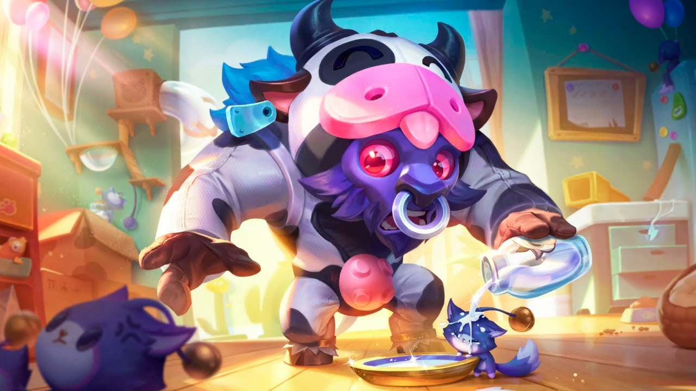

# Jogo da Memória - League of Legends

Um jogo da memória interativo com tema de League of Legends, apresentando personagens chibi e poros adoráveis. Teste sua memória, desafie seus amigos e acompanhe seu progresso!

## 📋 Conteúdo

- [Demonstração](#-demonstração)
- [Tecnologias](#-tecnologias)
- [Funcionalidades](#-funcionalidades)
- [Como Jogar](#-como-jogar)
- [Instalação](#-instalação)
- [Estrutura do Projeto](#-estrutura-do-projeto)
- [Créditos](#-créditos)
- [Licença](#-licença)

## 🎮 Demonstração

O jogo apresenta uma interface intuitiva com design gradiente roxo e azul, cartas com personagens de League of Legends e efeitos visuais quando você completa o jogo.

## 🚀 Tecnologias

Este projeto foi desenvolvido com as seguintes tecnologias:

- HTML5
- CSS3
- JavaScript (ES6+)
- LocalStorage para persistência de dados

## ✨ Funcionalidades

- **Três níveis de dificuldade**: Fácil (3 pares), Médio (6 pares) e Difícil (9 pares)
- **Sistema de pontuação**: Acompanhe quantas tentativas você precisou para completar o jogo
- **Histórico de jogadas**: Veja seus resultados anteriores
- **Efeitos visuais**: Animação de confete quando você vence
- **Design responsivo**: Jogue em qualquer dispositivo
- **Persistência de dados**: Seu histórico é salvo mesmo após fechar o navegador

## 🎯 Como Jogar

1. Escolha um nível de dificuldade (Fácil, Médio ou Difícil)
2. Clique nas cartas para virá-las
3. Tente encontrar todos os pares de cartas iguais
4. Complete o jogo com o menor número possível de tentativas
5. Seu resultado será salvo no histórico

## 💻 Instalação

Para jogar localmente, siga estas etapas:

1. Clone este repositório:

2. Navegue até a pasta do projeto:

3. Abra o arquivo `index.html` em seu navegador preferido

Ou simplesmente baixe o ZIP do projeto, extraia e abra o arquivo `index.html` em seu navegador.

## 📁 Estrutura do Projeto

\`\`\`
jogo-da-memoria-lol/
├── assets/
│   └── img/           # Imagens dos personagens
├── index.html         # Estrutura HTML do jogo
├── style.css          # Estilos CSS
├── script.js          # Lógica do jogo em JavaScript
└── README.md          # Documentação
\`\`\`

## 🙏 Créditos

- Imagens de personagens: League of Legends © Riot Games
- Conceito e desenvolvimento: [Seu Nome]

## 📝 Licença

Este projeto está sob a licença MIT. Veja o arquivo [LICENSE](LICENSE) para mais detalhes.

---

Desenvolvido com ❤️ por Jorge Tavares
\`\`\`

